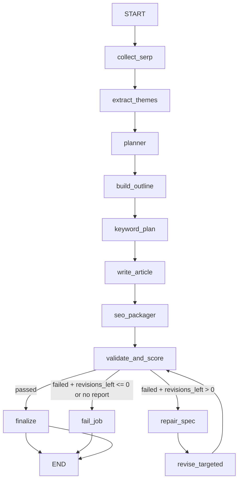
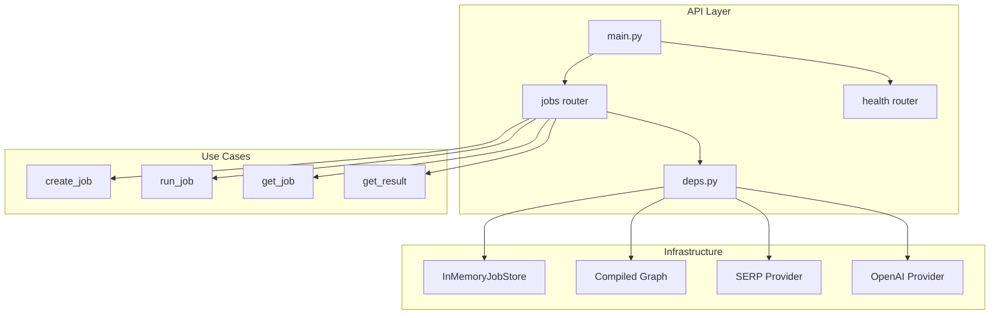
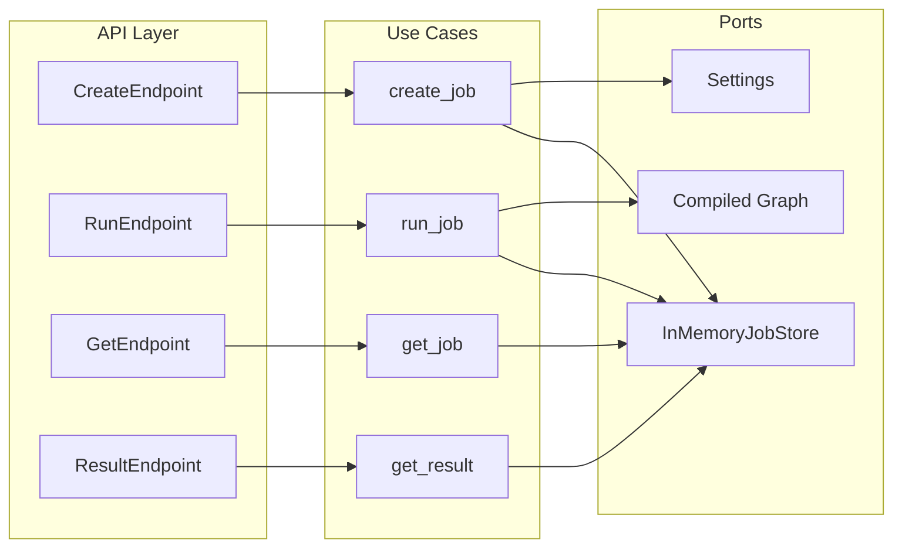

# SEO Agentic Backend

SERP-grounded SEO article generator with a LangGraph **plan-execute-verify-repair** loop. Produces structured articles (markdown + SEO metadata) from a topic, using mock or live SERP data and OpenAI for content generation.

---

## Overview

Given a topic (e.g. `"best seo tools"`), the pipeline:

1. **Collects SERP** results (mock or live) for competitive context
2. **Extracts themes** (search intent, topic clusters, common sections)
3. **Plans** content structure with section budgets and word counts
4. **Builds outline** (H1 → H2 sections keyed by plan)
5. **Plans keywords** (primary + secondary from SERP candidates)
6. **Writes article** markdown from outline + keyword plan
7. **Packages SEO** (title, meta description, internal links, external refs)
8. **Validates** against deterministic rules (word count, meta length, keyword placement, etc.)
9. **Replies** or **revisions**: if validation fails and revisions remain, it **repairs** (spec) and **revises** (targeted LLM edits), then re-validates until pass or max revisions exhausted

---

## Architecture Diagrams

### Orchestration Graph (LangGraph)



### API Layer



### Job Flow (Use Cases → Ports)



---

## Pipeline Nodes

| Node | Purpose |
|------|---------|
| `collect_serp` | Fetch top 10 SERP results for topic (MockSerpProvider or live) |
| `extract_themes` | LLM: themes (search intent, topic clusters, common sections) |
| `planner` | LLM: Plan with H1, intro budget, section budgets (0.75–1.25× target) |
| `build_outline` | LLM: Outline (H1, H2 sections keyed by plan section_ids) |
| `keyword_plan` | LLM + candidates: primary = topic, secondary from SERP |
| `write_article` | LLM: Markdown from outline + keyword plan |
| `seo_packager` | LLM: SeoPackage (title, meta, links, keyword_usage) |
| `validate_and_score` | Deterministic checks; score = passed / total |
| `finalize` | Build `SeoArticleOutput`, store in JobStore, mark COMPLETED |
| `repair_spec` | Map failed checks → RepairSpec (targets, instructions) |
| `revise_targeted` | LLM: Fix article per RepairSpec |
| `fail_job` | Mark job FAILED when revisions exhausted |

---

## GraphState

Typed state (Pydantic) flowing through nodes. Each node returns a **patch dict** merged into state.

| Field | Type | Set by |
|-------|------|--------|
| `job_id`, `input` | JobInput | Initial |
| `serp_results` | list[SerpResult] | collect_serp |
| `themes` | Themes | extract_themes |
| `plan` | Plan | planner |
| `outline` | Outline | build_outline |
| `keyword_plan` | KeywordPlan | keyword_plan |
| `article_markdown` | str | write_article, revise_targeted |
| `seo_package` | SeoPackage | seo_packager, revise_targeted |
| `validation_report` | ValidationReport | validate_and_score |
| `repair_spec` | RepairSpec | repair_spec |
| `revisions_left` | int | Decremented in revise_targeted |

---

## Validation Checks

| Check | Rule |
|-------|------|
| `primary_in_title_tag` | Primary keyword in title |
| `primary_in_intro` | Primary in first paragraph (H1 → first H2) |
| `primary_in_h2` | Primary in at least one H2 |
| `heading_hierarchy_valid` | Exactly 1 H1, H3 only under H2, H4 allowed (e.g. FAQs), no H5+ |
| `word_count_within_tolerance` | Target ± 15% (configurable) |
| `meta_description_length_valid` | 140–160 chars |
| `internal_links_count_valid` | 3–5 links |
| `external_refs_count_valid` | 2–4 refs |
| `output_schema_valid` | SeoArticleOutput schema |

---

## API Endpoints

| Method | Path | Description |
|--------|------|-------------|
| GET | `/health` | Health check |
| POST | `/jobs` | Create job; `run_immediately: true` runs inline |
| POST | `/jobs/{id}/run` | Run pending job |
| GET | `/jobs/{id}` | Job status |
| GET | `/jobs/{id}/result` | Result (409 if not completed) |

---

## Project Structure

```
src/
├── api/              # FastAPI routers, schemas, deps
├── application/      # Use cases, orchestration (graph, nodes, state)
├── domain/           # Models (JobInput, Outline, Plan, SeoPackage, etc.)
└── infrastructure/   # Providers (LLM, SERP), stores (InMemoryJobStore)
tests/
├── unit/             # Pure tools, nodes, validators
├── integration/      # Graph with FakeLLM + MockSerp
└── e2e/              # FastAPI TestClient with dependency overrides
```

---

## Requirements

- Python 3.11+
- OpenAI API key (for LLM calls; optional in dev with `SERP_PROVIDER=mock`)
- LangSmith API key (optional; for observability and tracing)
- Streamlit (included in project deps; for the Streamlit UI)

---

## Quickstart (local)

```bash
cp .env.example .env
# Set OPENAI_API_KEY in .env
pip install -e ".[dev]"
uvicorn src.main:app --reload --port 8000
```

---

## Docker

```bash
cp .env.example .env
# Set OPENAI_API_KEY in .env
docker compose up --build
```

API: http://localhost:8000. Docs: http://localhost:8000/docs.

---

## Example Usage

```bash
# Create and run job immediately
curl -X POST http://localhost:8000/jobs \
  -H "Content-Type: application/json" \
  -d '{"topic": "best seo tools", "run_immediately": true}'

# Get job status
curl http://localhost:8000/jobs/{job_id}

# Get result (when completed)
curl http://localhost:8000/jobs/{job_id}/result
```

Or use `scripts/example_request.sh` for a full flow (make executable with `chmod +x scripts/*.sh` on Unix).

---

## Environment Variables

| Variable | Default | Description |
|----------|---------|-------------|
| `OPENAI_API_KEY` | — | Required for LLM (optional in dev) |
| `DEFAULT_WORD_COUNT` | 1500 | Target word count |
| `DEFAULT_LANGUAGE` | en | Content language |
| `MAX_REVISIONS` | 2 | Max validation repair attempts |
| `SERP_PROVIDER` | mock | `mock` (offline) or `live` |
| `LOG_LEVEL` | INFO | Logging level |
| `LANGCHAIN_TRACING_V2` | true | Enable LangSmith tracing |
| `LANGCHAIN_API_KEY` | — | LangSmith API key (optional) |
| `LANGCHAIN_PROJECT` | seo-agentic-backend | LangSmith project name |

---

## Observability (LangSmith)

Tracing is enabled via LangSmith for LLM calls, graph runs, and chain steps. Set `LANGCHAIN_API_KEY` in `.env` to send traces to [LangSmith](https://smith.langchain.com). With `LANGCHAIN_TRACING_V2=true` (default), runs appear in the configured project for debugging and latency analysis.

---

## Testing

```bash
pytest
# or
./scripts/run_tests.sh
```

- **Unit**: markdown/keyword tools, validators, repair spec, nodes
- **Integration**: full graph with FakeLLMProvider + MockSerpProvider (no network)
- **E2E**: FastAPI TestClient with dependency overrides

---

## Design Decisions

- **Sync execution**: No background workers; graph runs in-process. Suitable for assessment and low concurrency.
- **In-memory stores**: JobStore and checkpointer use LangGraph `InMemoryStore` and `InMemorySaver`. No DB required. Resume is durable within the running process only (see [Durability Notes](#durability-notes-assessment-vs-production)).
- **Thin API**: Routers call use cases only; `api/deps.py` wires infrastructure.
- **FakeLLM for tests**: Integration and e2e tests use `FakeLLMProvider` + `MockSerpProvider`; no network calls.
- **Repair targets**: `__intro__`, `__seo_meta__`, or section IDs; reviser produces fixed markdown per RepairSpec.
